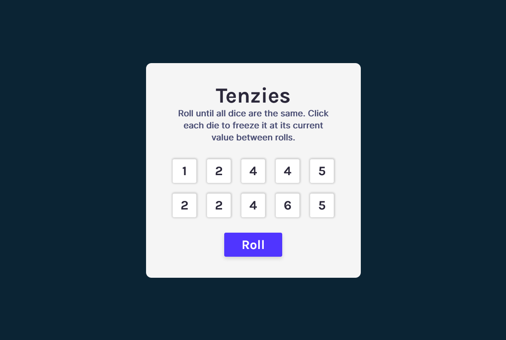

# Scrimba - Tenzies Game Project

This is one of the final projects after 11 hours React Course on [scrimba](https://scrimba.com/) by [Bob Ziroll](https://twitter.com/bobziroll).

## Table of contents

- [Overview](#overview)
  - [The challenge](#the-challenge)
  - [Screenshot](#screenshot)
  - [Links](#links)
- [My process](#my-process)
  - [Built with](#built-with)
  - [Depolyment](#deploy-process)
  - [What I learned](#what-i-learned)
  - [Continued development](#continued-development)
  - [Useful resources](#useful-resources)
- [Author](#author)
- [Acknowledgments](#acknowledgments)

## Overview

### The challenge

Users should be able to:

- Make HTML base structure and CSS design as indicated in [figma file](https://www.figma.com/file/1aj3XqV79CF3H99oTc5Y9O/Tenzies-(Copy)?node-id=2%3A31)
- Make interaction by using React.js library
- When user click on roll button each die must be changed randomly 1 to 6 if it is not hold.
- When user hold all same dies, change button to New Game and integrate and run Confetti package.
- **Bonus**: While user click count each count and show.
- **Bonus**: When user win, show the shortest winner time keeped in localStorage and user's time
- **Bonus**: Change numbers to dots aa they represent dice.
- **Bonus**: Make it responsive

### Screenshot



### Links

- Solution URL: [Project solution link](https://github.com/alisariyer/tenzies/)
- Live Site URL: [Live site url](https://alisariyer.github.io/tenzies/)

## My process

### Built with

- Semantic HTML5 markup
- CSS custom properties
- Flexbox
- CSS Grid
- Mobile-first workflow
- [React](https://reactjs.org/) - JS library

### Deploy process

1. Install gh-pages from terminal: npm install gh-pages **--save-dev**
2. Add "homepage": "https://{username}.github.io" into package.json file after name, version etc. values
3. In package.json file in scripts value add again a key-value pair as:
4. "predeploy": "npm run build"
5. "deploy": "gh-pages -d build"
6. If you've not initilalized your git repository: "git init" **then** "git remote add origin your-github-repository-url.git"
7. Then run from terminal: "npm run deploy"
8. Choose in github pages as branch: gh-pages then publish.

### What I learned

I learned and practices React.js, lazy states, useEffect, modular programming, helper functions, shorter and clever algorithms.

```javascript
    // check if all die is hold and all die value is same
    const isWin = dice.every(
      (die) => die.isHeld && die.value === dice[0].value
    );

    function allNewDice() {
    // TIP: [...Array(10).keys()] to create a list [0, 1, ... 10]
    // create an array of object to keep 10 random numbers and held status
    return Array.from("helloworld").map((x) => generateNewDie());
  }
```

### Continued development

I'll focus in React.js deeply to make more modular application and also practice JavaScript challanges to have a good experience on JS. Grid CSS also I'll try to use more to learn well.

## Author

- Website - [Ali Sariyer](https://www.alisariyer.com)
- Linkedin - [Ali Sariyer](https://www.linkedin.com/in/alisariyer)
- Twitter - [@sariyer_ali](https://www.twitter.com/sariyer_ali)